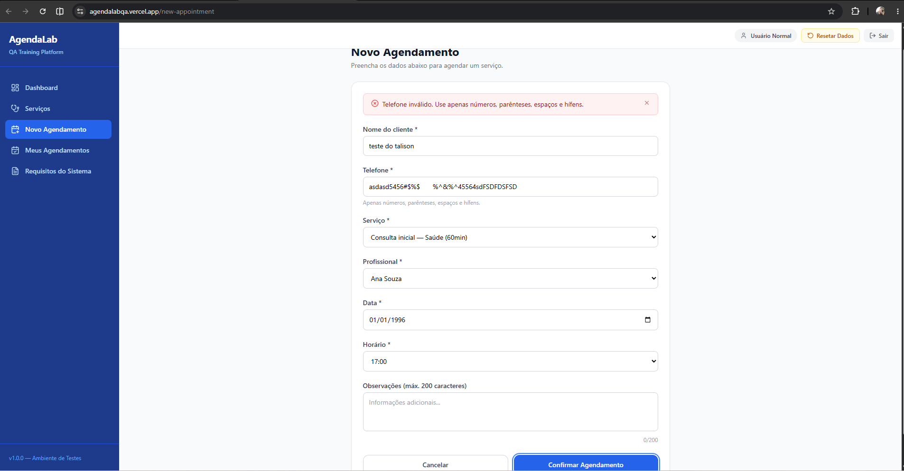
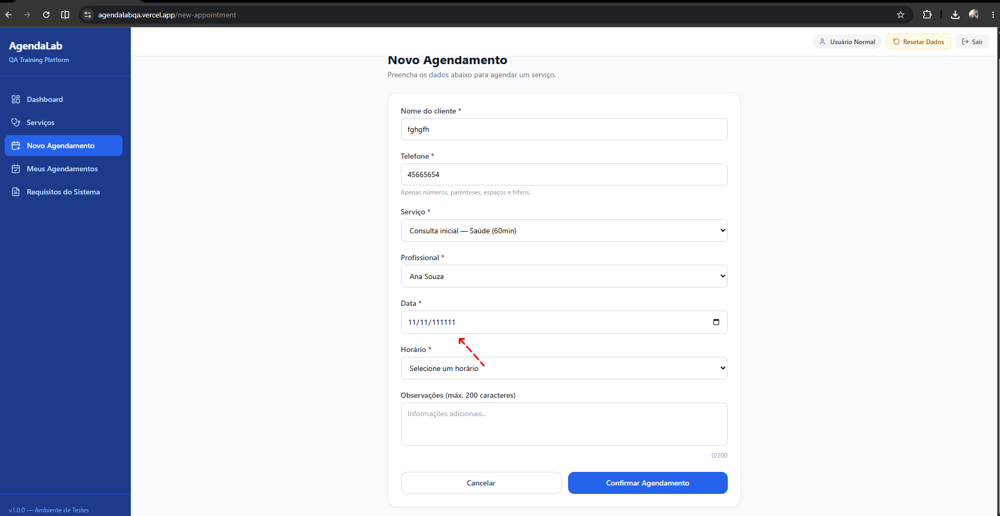

# 🧪 Relatório de Testes Funcionais — Plataforma AgendaLab

* **Analista de Qualidade:** Talison Vieira Brito
* **Ambiente de Testes:** [https://agendalabqa.vercel.app/](https://agendalabqa.vercel.app/)
* **Data da Execução:** 24/06/2026
* **Navegador Utilizado:** Google Chrome (Versão 149.0.7827.197 64 bits)

---

## 🎯 Objetivo
Validar o correto funcionamento do fluxo de **Novo Agendamento** na plataforma AgendaLab, garantindo a conformidade com as regras de negócio estabelecidas e mitigando riscos antes do lançamento em produção.

## 📝 O que é BDD (Behavior-Driven Development)
O BDD é uma prática de desenvolvimento de software que visa integrar as regras de negócio com a especificação técnica e os testes. Ele utiliza uma linguagem natural, simples e estruturada para descrever como o sistema deve se comportar do ponto de vista do usuário final.

### 📊 Massa de Teste Utilizada
* **Usuário:** `usuario_normal`
* **Senha:** `secret123`

---

## 📑 Requisitos do Sistema e Critérios de Aceitação

Para a modelagem dos cenários de teste, foi utilizada como base a documentação oficial de requisitos funcionais da plataforma AgendaLab QA, focando especificamente no módulo de **Novo Agendamento (RF004)**.

📸 **Documentação de Referência:**

---

## 📋 Cenários de Teste (CT)

### 👤 Campo: Nome

#### **CT-01: Validar campos obrigatórios do formulário de agendamento**
**Dado** que o usuário está na tela de agendamento  
**Quando** ele tenta confirmar o agendamento deixando os campos "Nome", "Telefone", "Serviço", “Profissional”, "Data" e “Horário” vazios  
**Então** o sistema deve exibir as respectivas mensagens de erro informando que os campos são obrigatórios  
**E** o agendamento não deve ser processado

* **Status:** 🟢 Aprovado
* **Resultado Esperado:** O sistema deve impedir o envio do formulário, destacar todos os campos obrigatórios ausentes e exibir as respectivas mensagens de alerta.
* **Resultado Obtido:** O formulário foi totalmente bloqueado e o sistema exibiu corretamente os alertas de obrigatoriedade para os campos Nome, Telefone, Serviço e Data, impedindo o processamento do agendamento.
* **Evidência:** [Clique aqui para ver](./ct-01.png.png) | [Imagem 2](./ct-01-1.png.png) | [Imagem 3](./ct-01-2.png.png)

#### **CT-02: Validar campo Nome aceitando apenas letras e espaço (exceto primeiro caractere)**
**Dado** que o usuário está na tela de agendamento  
**Quando** ele insere no campo "Nome" números, caracteres especiais (#$%) e inicia com espaço  
**Então** o campo não deve aceitar a digitação dos mesmos

* **Status:** 🔴 Reprovado
* **Resultado Esperado:** O campo deve rejeitar caracteres inválidos (números/símbolos) e impedir espaços em branco no início da entrada.
* **Resultado Obtido:** O sistema permitiu a inserção de caracteres numéricos, especiais e espaço no início do campo, sem apresentar validações.
* **Evidência:** [Clique aqui para ver](./ct-02.png.png) | [Imagem 2](./ct-02-1.png.png)

---

### 📞 Campo: Telefone

#### **CT-03: Validar campo Telefone aceitando apenas números e caracteres da máscara**
**Dado** que o usuário está digitando no campo "Telefone"  
**Quando** ele digita letras ou caracteres especiais (fora os caracteres da máscara)  
**Então** o campo deve ignorar esses caracteres, mantendo apenas os números

* **Status:** 🔴 Reprovado
* **Resultado Esperado:** A entrada de texto deve ser restrita a dígitos numéricos, formatando automaticamente o texto de acordo com a máscara telefônica estabelecida.
* **Resultado Obtido:** A máscara falhou em restringir a entrada, permitindo a digitação livre de caracteres alfabéticos e símbolos especiais.
* **Evidência:**[Clique aqui para ver](./ct-03.png.png)

#### **CT-04: Validar bloqueio e liberação do campo Profissional**
**Dado** que o usuário acabou de acessar a tela de agendamento  
**Então** o campo "Profissional" deve estar desabilitado para seleção  
**Quando** o usuário seleciona uma opção válida no campo "Serviço"  
**Então** o campo "Profissional" deve ficar disponível para seleção

* **Status:** 🟢 Aprovado
* **Resultado Esperado:** O seletor "Profissional" deve permanecer desabilitado nativamente até que uma opção válida seja definida no campo "Serviço".
* **Resultado Obtido:** O comportamento do elemento seguiu a regra de dependência: permaneceu bloqueado inicialmente e foi liberado após a seleção do serviço.
* **Evidência:** [Clique aqui para ver](./ct-04.gif.gif)

#### **CT-05: Validar filtro de Profissionais por Serviço selecionado**
**Dado** que o usuário selecionou o serviço "Consulta inicial"  
**Quando** ele abre a lista de opções do campo "Profissional"  
**Então** o sistema deve exibir apenas os profissionais vinculados ao serviço selecionado  
**E** não deve exibir profissionais de outros serviços (ex: "Massagem relaxante")

* **Status:** 🟢 Aprovado
* **Resultado Esperado:** A listagem do componente deve ser filtrada dinamicamente, exibindo apenas os profissionais vinculados à especialidade selecionada.
* **Resultado Obtido:** O filtro funcionou corretamente, exibindo exclusivamente os profissionais associados ao serviço escolhido.
* **Evidência:** [Clique aqui para ver](./ct-05.png.png) | [Imagem 2](./ct-05-1.png.png)

---

### 📅 Campo: Data

#### **CT-06: Validar campo Data respeitando a máscara**
**Dado** que o usuário está digitando no campo "Data"  
**Quando** ele insere os números correspondentes ao dia, mês e ano  
**Então** o sistema deve aplicar automaticamente a máscara DD/MM/AAAA

* **Status:** 🔴 Reprovado
* **Resultado Esperado:** A digitação deve respeitar estritamente o limite de caracteres da máscara padrão DD/MM/AAAA.
* **Resultado Obtido:** O campo falhou na limitação de caracteres do bloco correspondente ao ano, permitindo a inserção de até 6 dígitos.
* **Evidência:** [Clique aqui para ver](./ct-06.png.png)

#### **CT-07: Validar impedimento de agendamento em data retroativa**
**Dado** que a data atual do sistema é hoje  
**Quando** o usuário tenta selecionar ou digitar uma data anterior ao dia atual  
**E** seleciona o botão “Confirmar agendamento” com todos os campos obrigatórios preenchidos  
**Então** o sistema deve exibir uma mensagem informando que a data não é válida por ser retroativa

* **Status:** 🟢 Aprovado
* **Resultado Esperado:** O sistema deve bloquear a confirmação do agendamento para períodos passados, retornando um alerta restritivo.
* **Resultado Obtido:** O bloqueio foi efetuado com sucesso e o alerta impeditivo de data retroativa foi gerado em tela.
* **Evidência:** [Clique aqui para ver](./ct-07.png.png)

#### **CT-08: Validar aviso de impedimento de agendamento aos domingos (Interface)**
**Dado** que eu estou na tela de formulário de agendamento  
**Quando** eu seleciono uma data que cai em um "Domingo" (ex: "28/06/2026")  
**Então** o sistema deve exibir a mensagem abaixo do campo “Data” informando que não são permitidos agendamentos aos domingos

* **Status:** 🟢 Aprovado
* **Resultado Esperado:** Exibição de um rótulo de erro logo abaixo do seletor de data, ao selecionar um dia correspondente a domingo.
* **Resultado Obtido:** A mensagem de aviso foi renderizada na interface imediatamente após a seleção da data inválida.
* **Evidência:** [Clique aqui para ver](./ct-08.png.png)

#### **CT-09: Validar aviso de impedimento de agendamento aos domingos (Submissão)**
**Dado** que eu preenchi todos os campos obrigatórios do formulário  
**Quando** eu clico no botão "Confirmar Agendamento"  
**Então** o sistema não deve processar o agendamento  
**E** deve exibir um alerta de erro no topo da tela com a mensagem: "Não é possível agendar para domingo."

* **Status:** 🟢 Aprovado
* **Resultado Esperado:** Ao tentar submeter o formulário com um domingo selecionado, o processamento deve ser interrompido e um alerta global de erro deve surgir no topo da tela.
* **Resultado Obtido:** O agendamento foi retido pelo sistema e o alerta no topo da tela foi exibido com a mensagem correta ("Não é possível agendar para domingo.").
* **Evidência:** [Clique aqui para ver](./ct-09.png.png)

---

### ⏰ Campo: Horário

#### **CT-10: Validar bloqueio e liberação do campo Horário**
**Dado** que o usuário está preenchendo o formulário  
**Quando** os campos "Profissional" e "Data" não estiverem preenchidos  
**Então** o campo "Horário" deve permanecer desabilitado  
**Quando** ambos os campos "Profissional" e "Data" estiverem preenchidos  
**Então** o campo "Horário" deve ficar disponível para preenchimento

* **Status:** 🟢 Aprovado
* **Resultado Esperado:** O campo "Horário" deve manter o estado desabilitado até que as condições de dependência (Profissional e Data) sejam satisfeitas.
* **Resultado Obtido:** O seletor comportou-se de forma reativa, liberando o acesso somente após o preenchimento de ambas as dependências.
* **Evidência:** [Clique aqui para ver](./ct-10.gif.gif)

#### **CT-11: Validar as opções disponíveis no campo Horário**
**Dado** que o campo "Horário" foi liberado para preenchimento  
**Quando** o usuário abre as opções de horários  
**Então** o sistema deve listar estritamente as opções: 08h, 09h, 10h, 11h, 13h, 14h, 15h, 16h e 17h

* **Status:** 🟢 Aprovado
* **Resultado Esperado:** O menu suspenso (dropdown) de horários deve listar unicamente os períodos comerciais definidos na especificação técnica.
* **Resultado Obtido:** A listagem exibiu estritamente o escopo de horários delimitados na regra de negócio.
* **Evidência:** [Clique aqui para ver](./ct-11.png.png)

---

### 💬 Campo: Observações e Regras de Negócio Gerais

#### **CT-12: Validar campo Observações como opcional e limite de caracteres**
**Dado** que o usuário está no campo "Observações"  
**Quando** ele deixa o campo totalmente vazio  
**Então** o sistema deve permitir o avanço, pois o campo não é obrigatório  
**Quando** o usuário tenta digitar mais de 200 caracteres no campo  
**Então** o sistema deve impedir a digitação a partir do 201º caractere (limite máximo de 200)

* **Status:** 🟢 Aprovado
* **Resultado Esperado:** O sistema deve permitir a conclusão do agendamento sem dados neste campo e travar fisicamente a inserção a partir do 201º caractere.
* **Resultado Obtido:** O fluxo de sucesso foi mantido com o campo em branco e o limite estrito de 200 caracteres impediu entradas adicionais.
* **Evidência:** [Clique aqui para ver](./ct-12.gif.gif)

#### **CT-13: Validar impedimento de agendamento duplicado (Mesmo Profissional, Data e Horário)**
**Dado** que já existe um agendamento confirmado para o "Profissional X" na "Data Y" no "Horário Z"  
**Quando** realizo um agendamento para o mesmo "Profissional X", na mesma "Data Y"  
**Então** no seletor de horários não é possível clicar em um horário que já tem um agendamento marcado

* **Status:** 🟢 Aprovado
* **Resultado Esperado:** O seletor de horários deve exibir como desabilitado ou indisponível o horário que já possui um agendamento confirmado para o mesmo profissional e data.
* **Resultado Obtido:** O horário em conflito foi exibido de forma indisponível, impedindo o clique do usuário.
* **Evidência:** [Clique aqui para ver](./ct-13.gif.gif)

#### **CT-14: Validar confirmação de agendamento com sucesso**
**Dado** que o usuário preencheu todos os campos obrigatórios corretamente  
**E** cumpriu todas as regras de validação (nome, telefone, serviço, profissional, data válida e horário disponível)  
**Quando** ele clica no botão “Confirmar agendamento”  
**Então** deve exibir uma mensagem de sucesso na tela informando que o agendamento foi realizado com êxito  
**E** deve exibir o agendamento na aba “Meus agendamentos”

* **Status:** 🟢 Aprovado
* **Resultado Esperado:** O sistema deve persistir os dados informados, disparar uma notificação visual de sucesso e listar o novo registro na aba de controle do usuário.
* **Resultado Obtido:** A mensagem de sucesso foi exibida adequadamente na interface e o novo agendamento constou imediatamente no histórico da aba "Meus agendamentos".
* **Evidência:** [Clique aqui para ver](./ct-14.gif.gif)

---

## 📊 Relatório de Execução dos Testes

| Métrica | Quantidade | Percentual | Status |
| :--- | :---: | :---: | :---: |
| **Total de Casos de Teste (CTs)** | 14 | 100% | 📋 |
| **CTs Aprovados** | 11 | 78.57% | 🟢 Pass |
| **CTs Reprovados** | 3 | 21.43% | 🔴 Fail |

### 🔍 Considerações Finais
* **Taxa de Sucesso:** O projeto apresentou uma estabilidade de 78.57% nos cenários mapeados.
* **Próximos Passos:** Os 3 cenários reprovados foram documentados com suas respectivas evidências e serão encaminhados para correção (Refatoração/Correção de Bugs). Após o ajuste, um novo ciclo de testes de regressão será executado para garantir a conformidade do sistema.

---

## 🐛 Registro de Bugs (Bug Reports)

#### 🐜 BUG-01: Campo "Nome" aceita caracteres inválidos e espaço inicial
* **ID do Caso de Teste:** CT-02
* **Severidade:** Média 🟡
* **Componente:** Formulário de Novo Agendamento -> Campo Nome
* **Descrição:** O campo "Nome" permite a inserção e permanência de números, caracteres especiais (como `#$%`) e aceita que o primeiro caractere seja um espaço em branco, violando o critério de aceitação que prevê apenas letras e espaços internos.

**👣 Passos para Reproduzir:**
1. Acesse a plataforma `AgendaLabQA` e faça login.
2. Navegue até a aba **Novo Agendamento**.
3. No campo **Nome**, digite `   Talison 123 #$%`.
4. Preencha os demais campos obrigatórios com dados válidos.
5. Clique em **Confirmar agendamento**.

* **Resultado Esperado:** O sistema deve bloquear a digitação de caracteres numéricos/especiais e impedir o espaço inicial, ou exibir uma validação de campo inválido.
* **Resultado Obtido:** O campo aceita todos os caracteres digitados e permite o avanço do formulário.

**📸 Evidências do BUG-01:**

---

#### 🐜 BUG-02: Campo "Telefone" permite digitação de letras e ignora a máscara de entrada
* **ID do Caso de Teste:** CT-03
* **Severidade:** Média 🟡
* **Componente:** Formulário de Novo Agendamento -> Campo Telefone
* **Descrição:** Ao interagir com o campo "Telefone", o sistema aceita a digitação de caracteres alfabéticos (letras), espaços livres e caracteres especiais que não pertencem à formatação padrão da máscara telefônica.

**👣 Passos para Reproduzir:**
1. Acesse a aba **Novo Agendamento**.
2. Clique no campo **Telefone**.
3. Tente digitar texto alfabético (Ex: `TelefoneTeste`).
4. Insira caracteres fora da máscara (Ex: `*&*&`).

* **Resultado Esperado:** O campo deve ignorar qualquer entrada que não seja numérica, aplicando a máscara automaticamente.
* **Resultado Obtido:** O campo aceita letras, espaços e símbolos fora do padrão estipulado.

> **Obs:** Recomenda-se ajustar o campo para aplicar a máscara de formatação automaticamente conforme os números sono digitados. Isso elimina a necessidade de o usuário inserir caracteres especiais manualmente e evita o estouro do limite máximo de dígitos.

**📸 Evidências do BUG-02:**

---

#### 🐜 BUG-03: Campo "Data" quebra comportamento da máscara e aceita ano com 6 dígitos
* **ID do Caso de Teste:** CT-06
* **Severidade:** Alta 🔴
* **Componente:** Formulário de Novo Agendamento -> Campo Data
* **Descrição:** A máscara do campo data (`DD/MM/AAAA`) falha na limitação de caracteres do campo correspondente ao ano, permitindo que o usuário insira até 6 dígitos (Ex: `24/06/202622`).

**👣 Passos para Reproduzir:**
1. Acesse a aba **Novo Agendamento**.
2. Clique no campo **Data**.
3. Digite uma data preenchendo o ano de forma estendida (Ex: `2406202622`).

* **Resultado Esperado:** A digitação deve ser travada assim que o 4º dígito do ano for inserido (`2026`), respeitando o formato limite `DD/MM/AAAA`.
* **Resultado Obtido:** O campo aceita até 6 numbers na seção do ano, exibindo visualmente `24/06/202622`.

**📸 Evidências do BUG-03:**

